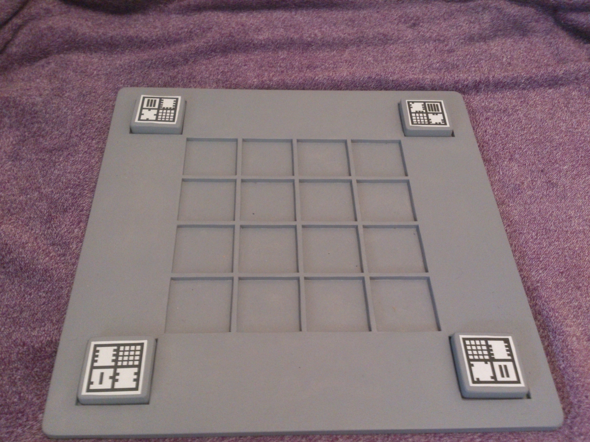

# AugmentedRealityDemoGame
Demo game shows educational capabilities of AR apps in early ages.    
VIDEO    
https://drive.google.com/open?id=11WsU8POHDqVpMC0uhhHNfQYn3hs2DmwT    
https://drive.google.com/open?id=1vlFSwFF2JrlepHej2-dK27Kt5oNy04rE   
https://drive.google.com/open?id=1GkCyi1soVxhKC7xVx00OLmZiEq-wg8bA   
    
1st part - physical wood board with blocks for creating path to pass for player.  
2nd part - AR app which scanns created path, calculates road and shows an animation.     

  
